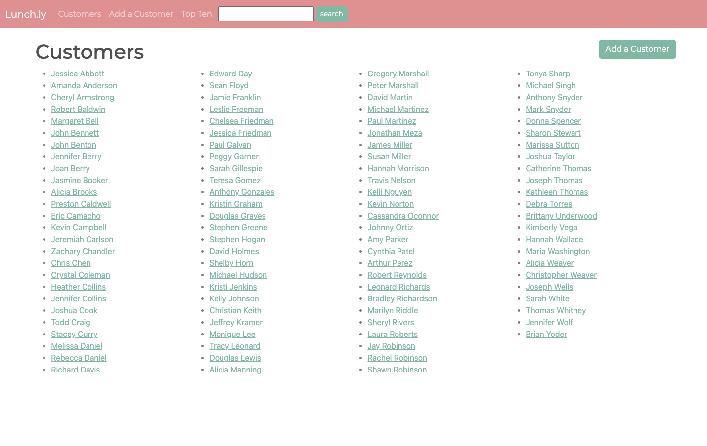
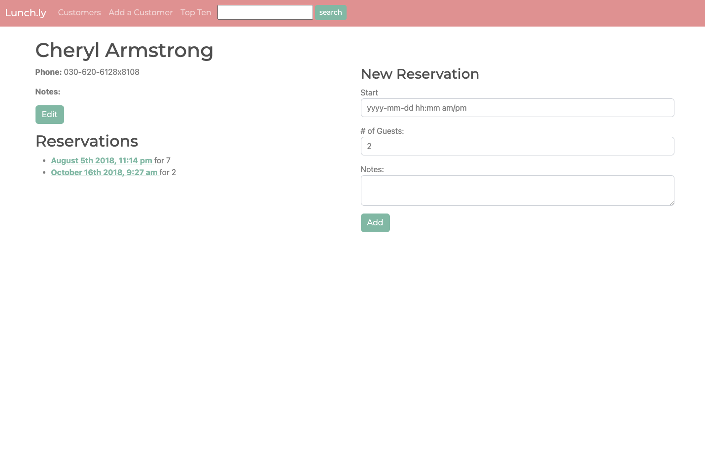
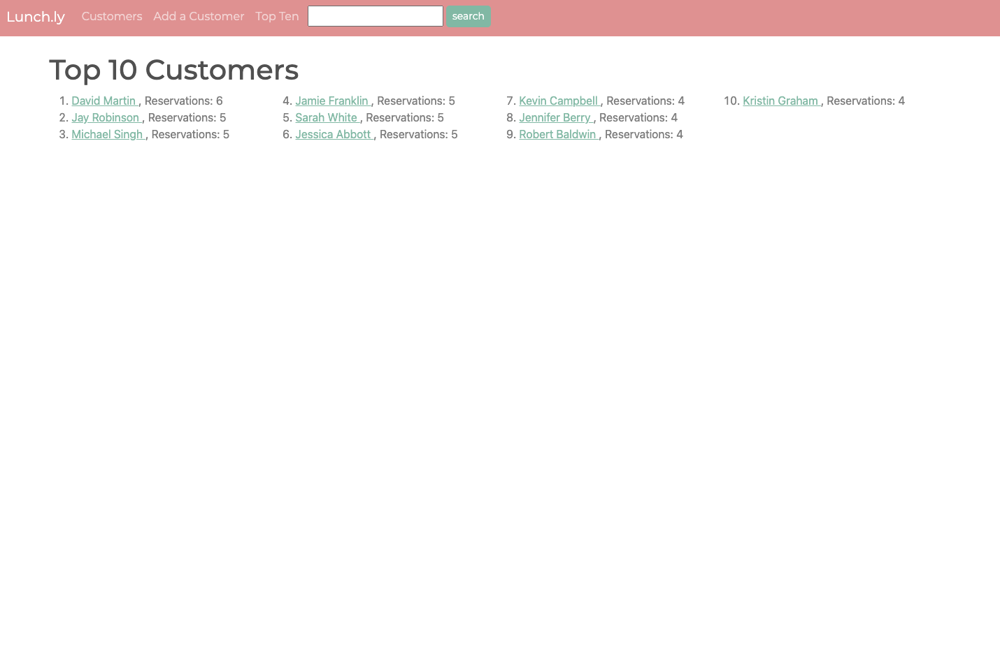
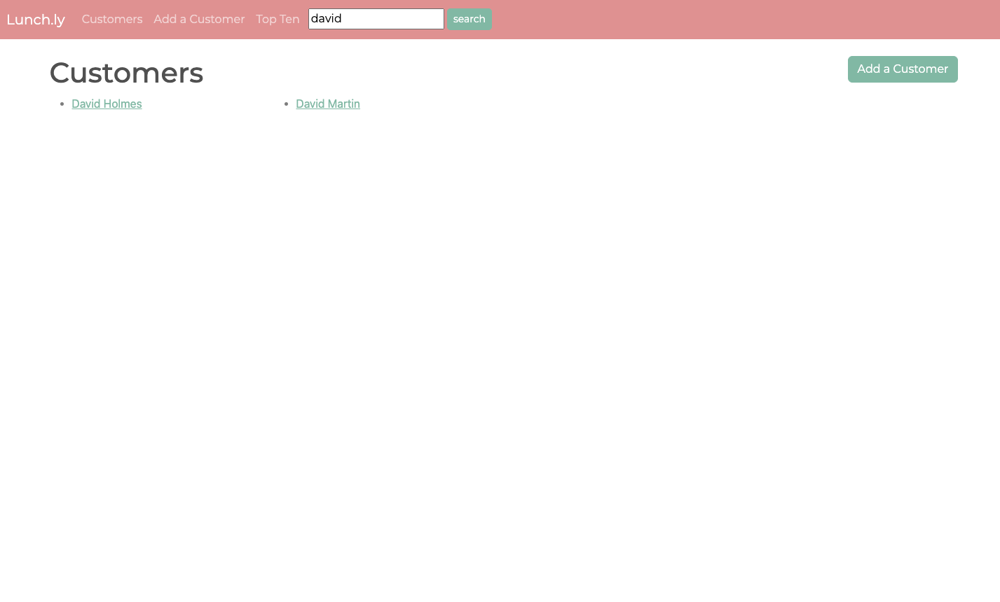

# Express Lunch.ly

Reservation system, a server-side templated application written in Express.js

## To run

Install required node modules:  

    npm install

Start server with nodemon

Visit http://localhost:3000

## Screenshots

1. Homepage lists customers in the system.

2. Click a customer to view and add reservations.

3. See Top 10 customers.

4. Search for customers.

